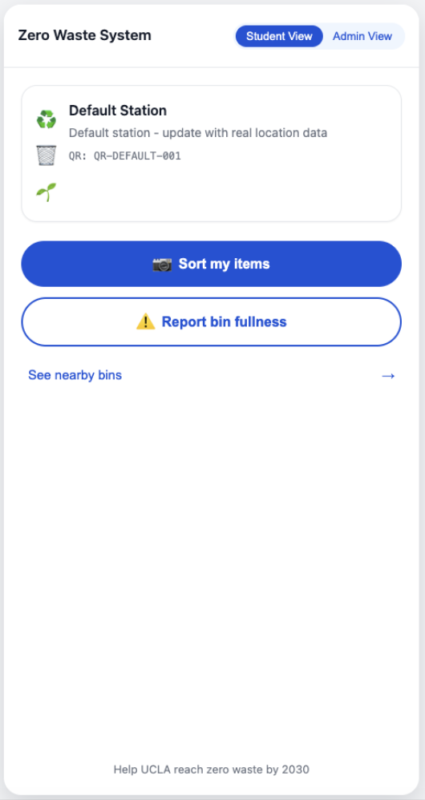
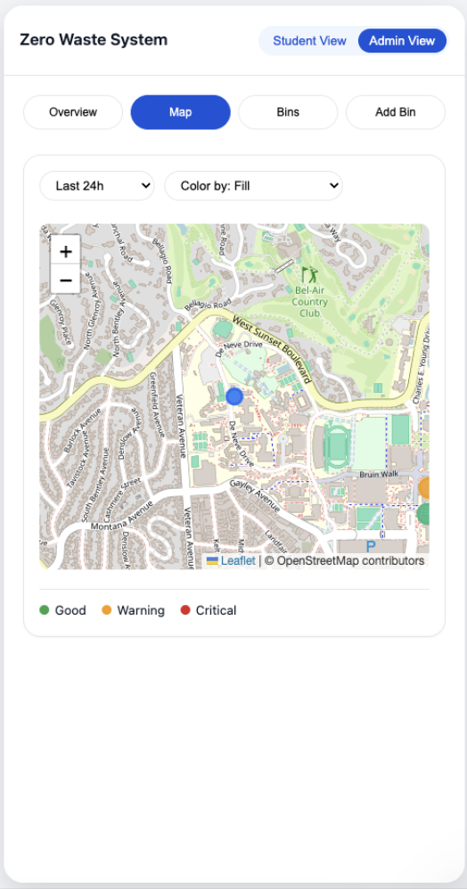
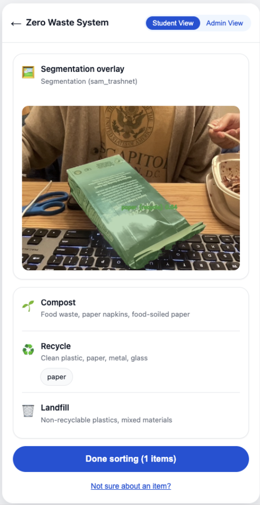

# Bruin Seg: A System for UCLA Students to Sort Smarter
## Introduction
Imagine this: You're rushing between classes at UCLA, coffee cup in one hand, phone in the other, and you've just finished eating at Ackerman Union. You approach the waste station and freeze. The cup has a plastic lid. The sleeve is paper. The cup itself claims to be "plant-based" but has a shiny coating. Do you separate them? Which bin for each part? You are late for something or don't want to waste your time searching up how to properly sort. So you make your best guess or more likely, you just toss everything into landfill bin and move on.
This moment of uncertainty happens thousands of times every day across UCLA campus, and it leads to a huge negative impact on UCLA's sustainability goals. Despite UCLA's comprehensive zero-waste initiatives and clearly marked bin systems (landfill, recycling, compost), contamination rates remain high. Students want to do the right thing, but the rules feel inconsistent, the signage is unclear, and students don't want to waste time or don't care enough.
Thus we came up with Bruin Seg, a system that turns waste disposal into an informed decision instead of a rushed guess. By leveraging computer vision, real-time bin location data, and intelligent item segmentation, Bruin Seg can be accessed right at the bin through a QR code, and sort trash in under ten seconds, with zero app downloads required. This project was a result of lots of user research, think-aloud studies, and collaboration with UCLA's sustainability leadership, all to answer the motivating question of "How can we make accurate waste sorting as effortless as possible for busy college students?"

## Problem Statement
Students often face uncertainty when disposing of items that do not clearly fit into existing waste categories, reducing the effectiveness of waste separation efforts. A more accessible and informative system is needed to help these students make correct disposal decisions quickly and confidently at the point of disposal.
This problem manifests in two critical ways. First, mixed-material items (like pizza boxes with greasy bases and clean lids, or cups with separate lids and straws) create confusion about whether to separate components and where each part belongs. Second, time pressure at bins forces students into a decision window of just 2-10 seconds, leading many to default to landfill rather than risk getting it wrong. Our early observations at Ackerman revealed that students appeared confident in their sorting choices even when disposing incorrectly, suggesting a gap between perceived and actual knowledge of waste sorting rules.

## User Research: Understanding Disposal Behavior
Our user research evolved across multiple stages, progressively narrowing our focus from general sustainability efforts and personas into just targeting UCLA students to help them make disposal decisions.

### Initial Exploration: Semi-Structured Interviews
We began with semi-structured interviews targeting environmentally conscious individuals, sustainability volunteers, and student organization members. Our initial protocol explored general habits, pain points, and attitudes toward waste sorting. Early conversations revealed that environmental consciousness alone wasn't the defining factor and clarity mattered far more to actual behavior.
From our first three interviews, we learned that open ended questions like "Walk me through how you sort your trash" and "Think of a recent moment when it was hard to dispose of something correctly" surfaced rich insights about reasoning processes and decision making shortcuts. However, we also discovered that some questions were too closed-ended, leading to yes/no responses rather than meaningful discussion, and that our protocol lacked logical flow between topics.

**Key revision:** We reorganized our protocol into logical sections (daily habits - difficulties - potential solutions) and focused more on the "why" behind behaviors, not just the "what." We also expanded our participant pool beyond friends to capture more diverse perspectives.

### Deepening Understanding: Think-Aloud Studies
Our most valuable insights came from think-aloud studies conducted at actual waste stations across campus. We asked students to dispose of three challenging items while narrating their thought process:
1. A greasy pizza box (clean lid, greasy base)
2. A "plant-based" fry container with shiny lining
3. A clear PLA cup
The results were really insightfull. Students consistently exhibited several patterns:

**Decision Speed:** Most made choices within 2-10 seconds. One participant stated: "If it takes more than, like, five seconds, I just pick landfill." Another admitted: "If I can't decide in  about 2 seconds, compost unless it's obviously rigid plastic."

**Component Confusion:** Almost no one separated mixed material items unless explicitly prompted. As one student explained about a pizza box: "The lid is clean but the base is greasy... I'd probably just toss the whole thing in landfill to be safe."

**Material Misidentification:** PLA (plant-based plastic) and compostable packaging caused systematic errors. Students reported: "The PLA logo on the cup = compost for us" and "I tossed those little sauce containers into compost because the tray was compostable and I assumed the cups were too."

**Social Pressure:** Decision time was really influenced by amount of people at bins. Students were willing to be thoughtful when alone at bins but reverted to quick defaults when people waited behind them.

### Contextual Insights: Environmental Factors
Through contextual inquiry, we identified environmental factors that influenced disposal accuracy:

- **Signage placement and legibility:** Glare from overhead lighting made some bin labels hard to read

- **Bin capacity:** Overflowing bins discouraged accurate sorting ("If it's already contaminated, why bother?")

- **Physical constraints:** Students carrying multiple items or bags struggled with bins that required both hands

- **Location-specific rules:** Students knew some venues had different policies but couldn't remember which

### Personas
From our research, two primary personas emerged:

**Alisa - The Sustainability Enthusiast**
Alisa is an electrical engineering major living on the hill who actively volunteers with campus sustainability initiatives. She wants to visualize her environmental impact and values clear, tangible metrics showing her progress. At waste stations, she prefers tools that work instantly and provide plain-language explanations so she can educate others during outreach events. She needs shareable proof of impact stats for club fairs and social media posts.

**Jason - The Overwhelmed Student**
Jason is a computer science student who finds trash sorting confusing and tedious. He understands sustainability matters but thinks the rules are inconsistent, so he defaults to one bin to save time. Jason learns best through short, situational prompts rather than moral appeals, and responds better to humor than guilt. He would use a sorting tool only if it's instant, effortless, and doesn't interrupt his routine. He's a very busy student and does not like wasting time sorting.

### Contradicted Assumptions
Our research challenged several initial assumptions:

1. **Not all users are environmentally motivated:** Most students cared more about convenience and avoiding mistakes than about sustainability.

2. **Usage context is everyday, not special events:** We initially assumed the tool would be used during organized cleanups. Instead, with the help of our community partner we identified that students are the main cause of bin contamination, so we needed a system that targeted students in everyday disposal scenarios.

3. **Pulling out phone is actually acceptable:** We feared students wouldn't pull out phones at bins, but QR codes were deemed acceptable as occasional reference tools.

4. **One exposure creates lasting retention:** Students who learn a location specific rule once (like "Ackerman cups are compostable") remember it for days afterward.

## Design Goals
Based on our user research, we established two primary design goals that would guide all subsequent design decisions:
### Design Goal 1: Sub-5-Second Response with Zero Friction

**Goal:** Enable students to scan a QR code at any waste station and receive disposal guidance in under 5 seconds, with no typing and no app download required.

**Justification:** Our think-aloud studies revealed that disposal decisions happen within a 2-10 second window. As participants told us:
- "If it takes more than, like, five seconds, I just pick landfill."
- "I'm not reading paragraphs at a bin."
- "Would likely use QR at bin if it autoloads the camera and answers in ≤3s."
Any system that exceeds this time constraint will not be used. The QR-to-camera-to-answer flow eliminates app store friction, account creation, and manual input which would add unacceptable seconds to an already time pressured interaction.
### Design Goal 2: Explicit Component Breakdown with One Line Rationale

**Goal:** For mixed-material items, provide explicit part by part guidance (e.g., "cup to recycling, lid to landfill, straw to landfill") with a one line explanation for each decision.

**Justification:** Most sorting errors occur on multi component items. Students won't separate parts unless explicitly told to do so:
- "Pizza box is split: clean lid vs greasy base" (from our materials)
- "I tossed those little sauce containers into compost because the tray was compostable and I assumed the cups were too."
Generic advice like "check for contamination" doesn't translate to action. Students need itemized instructions they can execute immediately: "Top to compost. Bottom to landfill because of grease."

## System Design and Implementation
### Architecture Overview
Bruin Seg's architecture balances speed, accuracy, and real world constraints through our design:

**Frontend (React):**
- Progressive Web App accessible via QR code scanning
- No installation required, works immediately in mobile browsers (when deployed)
- Two primary views: Student View and Admin Dashboard
- Responsive design optimized for quick interactions on mobile devices

**Backend (Node.js + Express):**
- RESTful API serving classification results and bin location data
- Session management for tracking user interactions without requiring accounts
- Real-time bin status updates from student reports (e.g., Bin fullness)

**Data Layer (MongoDB):**
- Document-based storage for waste items, classifications, and bin locations
- Flexible schema supporting many details for each bin
- Aggregated metrics for admin dashboard (bin fullness, usage patterns)

**AI/ML Pipeline (Python + Hugging Face):**
- Computer vision model for item recognition via image upload
- Items are segmented, masked, and labeled (compost, recycling, landfill)

  
  
  

### Key Interaction Sequences

**Student Flow: Scanning and Sorting**
1. Student scans QR code at bin
2. Our web app opens with options for sorting items, reporting bin fullness, or locating nearby bins
3. Student presses to sort items
4. Student captures image of item
5. System processes image through CV model (~10 seconds)
6. Results screen displays:
   - Colored masks for each item
   - Bin assignment for each item (with icons for lanfill, recycling, or compost)
   - Option to see impact (How many of each waste category student has sorted)
7. Optional: Student reports bin fullness before exiting
8. Optional: Student can locate nearby bins with a map (Bin list also sorted with nearest bins in meters)

**Admin Flow: Monitoring and Analytics**
1. Admin goes into dashboard view
2. Campus map displays all bin locations color-coded by fullness status
3. Selectable metrics views:
   - Most frequently scanned items
   - Student-reported bin fullness issues
   - Usage trends over time

### Risk Mitigation
We identified three major technical risks during planning:
1. **Trash segmentation model taking too long:** Mitigated through testing many different computer vision models and approaches to ML sorting pipeline
2. **Model hallucination producing incorrect sorting:** Addressed with confidence thresholds
3. **Insufficient data quality for admin insights:** We tried properly addressing this but did not have enough time to gather more data and analyze how data quality would turn out

## Evaluation: Questions, Methods, and Analysis
### Research Questions
Our evaluation focused on two primary questions derived from our design goals:

**Question 1 (Usability):** How easily can users scan a trash item and understand the system's classification? What about for the admin side?

**Question 2 (Behavioral Impact):** Does the system help users make better disposal decisions by guiding them to the correct nearby bin and encouraging accurate disposal habits?

### Evaluation Methods and Metrics
We designed a mixed-methods evaluation combining quantitative surveys and qualitative interviews:
| Data Source | Detailed Metric / Question |
|-------------|----------------------------|
| **Survey: Usability of Scanning** | Likert Scale (1-5): • "It was easy to scan a trash item using this system." • "The classification was clear and understandable." • "I trusted the system's classification of my item." • "The instructions for scanning were easy to follow." • "I would feel comfortable using this system regularly." |
| **Survey: Impact on Disposal Behavior** | Likert Scale (1-5): • "This system helped me understand how to dispose of my item correctly." • "The map helped me locate the correct nearby bin quickly." • "Seeing distances made me more likely to dispose properly." • "Using this system would improve my future sorting accuracy." • "I feel more confident in my recycling decisions after using this tool." |
| **Interview: Scanning Workflow** | Open-ended probes: • "Walk me through what you expected when you scanned the item." • "What part of the scanning process, if any, felt confusing?" • "How did you interpret the classification result?" • "Would you trust this system in real-world use? Why or why not?" |
| **Interview: Admin Experience** | Open-ended probes: • "What was your goal when accessing the dashboard?" • "Which features did you find most/least useful?" • "What information would you want that wasn't available?" |
### Analysis Approach
During our usability tests we used our survey questions as well as the open ended questions in order to evaluate our system.

## Findings
### Core Functionality Works, But Clarity Needs Improvement
The system generally enabled users to scan items, view classifications, and locate nearby bins. During usability tests users indicated that the fundamental interaction flow made sense to them.
However, interviews revealed hesitation caused by **unclear buttons, inconsistent navigation, and occasional segmentation errors**. Several users mentioned uncertainty about whether they had successfully completed the scanning process. One participant noted: "I wasn't sure if I should press 'Done' or if it would automatically go back to the map." Another expressed confusion when the system classified a reflective food package as recycling but labeled it as metal.

### Navigation and Feedback Issues Reduced Confidence
While users could find and select bins on the map interface, **back-navigation issues and confusing view switches** made the application feel less intuitive than intended. The transition between camera capture, results display, and bin map created disorientation for some users who weren't sure how to return to previous screens or start a new scan.
The bin fullness reporting feature worked functionally but **lacked clear visual feedback**, leaving users uncertain whether their input had been recorded. One user stated: "I pressed the button to report the bin was full, but nothing happened... or at least I couldn't tell if it worked." This absence of confirmation undermines trust in the system's reliability. The fullness report worked, but our system did not have a success screen to inform users, thus creating that confusion.

### Admin Interface: Functional But Not Intuitive
Users assigned admin tasks were able to reach dashboard features and view bin status data, but **subtle interface issues made tasks feel less intuitive than we intended**. Unclear labels  and hidden functionality caused delays and confusion.
Several admin users requested **additional statistics and visualizations**: "I'd like to see overall trends by day, week, or month, not just current status" and "It would be helpful to see which bins get full fastest or have the most contamination." These requests point out that our system needed more statistics than we have implemented, which is something that we were planning to do but we didn't have enough time to implement. So we ended up only having a few simple statistics instead of having more detailed metrics like we initially planned.

### Mixed Trust in AI Classification
Trust in the system's classifications varied considerably. Users generally trusted straightforward categorizations (paper cup to compost, plastic bottle to recycling) but expressed doubts when results contradicted their existing beliefs or when the system handled edge cases. Users wanted **more explanation for why** an item belonged in a particular category, especially for non obvious cases.

### Expert Validation: Positive Reception with Key Suggestions
Our other community partner Alisa completed a walkthrough of the prototype and found the interaction flow "clear and appropriate for a campus sustainability tool." Her primary feedback was to **add a success or confirmation page** after students report bin fullness a direct validation of our finding that confirmation feedback was missing. She appreciated the simplicity of the scanning process and thought the item by item sort would be genuinely helpful for educating students.

## Discussion
### Key Takeaways

**Speed is a must in this context.** We had wished to classify and sort items in sub 5 seconds, but our system resulted in around 10 seconds to sort items and provide results to users. During usability tests we noticed some users were a little inpatient and wished it was quicker. In day to day use this would not be so acceptable by users. Thus figuring out speed optimizations is a must for improving our system.

**Education happens through use, not upfront tutorials.** We initially considered adding tutorial screens, but user feedback confirmed that students prefer learning by doing. Each successful scan teaches them a rule (e.g., "greasy pizza boxes to landfill") that they retain for future disposals, even without the app.

**Confirmation feedback is a must for trust.** A consistent complaint across both student and admin interfaces was lack of confirmation that actions had been completed. This is an easy usability issue to solve if we had some more time for implementing our project. In real use cases these little things are a must in interactive systems like ours, and it is not something hard to fix.

**Item by Item segmentation and classification is helpful but needs more desing considerations** Users appreciated the item by item sorting, but some users wished there were better labels and visual designs indicating correctly which item in the image belonged to a certain bin category. Items had colored masks overlays but some users complained that was not sufficient and wished to see more clear labels for each item segmented in the user's trash picture.

### Limitations
**Limited deployment scale:** We evaluated with a small number of users in controlled conditions, not during actual high traffic disposal moments in everyday scenarios. Real world validation with QR codes deployed at active bin stations would provide more valid data about whether students actually use the tool when rushed.

**Lack of student learning data:** We don't yet know whether initial usage translates to sustained behavior change. Do students who scan items once or twice internalize the rules and sort correctly without the app later? Or does accuracy decrease without continued reinforcement?

**Campus specific findings:** Our research focused entirely on UCLA students and UCLA specific waste policies. Generalizability to other universities or other public settings remains untested.

**Model accuracy not fully assessed:** While users generally trusted classifications, we didn't systematically validate model accuracy against ground truth. It would be better to do a more thorough evaluation of the model's accuracy.

### Future Work

**Immediate priorities (based on usability findings):**
1. Add confirmation screens and success feedback throughout
2. Improve admin dashboard and add more metrics
3. Add explanation text for non obvious classifications ("Why compost?" button, this could really help with student learning and is also something we did consider implementing in our initial implementation planning)

**Medium-term enhancements:**
1. Build historical analytics for admin view (trends over time, contamination hotspots)
2. Implement A/B testing of different explanation styles to find optimal educational messaging
4. Add different languages support

**Long-term research directions:**
1. Conduct long term study tracking disposal accuracy over weeks/months with and without app usage
2. Pilot QR deployment at 5-10 high-traffic bin stations across campus to gather real world usage data
3. Investigate whether gamification elements (streak tracking, social sharing) increase sustained engagement without undermining the "quick reference" goal. Gamification is something we had highly considered before our crit
4. Partner with UCLA Facilities Management to measure actual contamination rate changes in bins near deployed QR codes versus control locations

### Mistakes and Lessons Learned

**Mistake 1: Focusing on a specific product/solution since the beginning** Since the start of our project we had already thought about a product/solution for the problem we were trying to solve. So we were really focused on just developing the solution that we had thought about.

**Lesson:** In the inital stages of user research and prototyping we should have focused on the problem that we were trying to solve instead of focusing too much on the solution that we had thought about, which led us to pivot after our crit and also lose a lot of time that could have been used better.

**Mistake 2: Thinking about too many different features during initial prototyping.** We thought and planned extensive features (leaderboards, user profiles, achievement badges) based on assumptions about gamification, but after our crit and consultation with course staff we shifted our focus to a more educational system. Time spent thinking about and elaborating these features could have been used actually thinking about the core features our system needed as well as metrics we could collect and how.

**Lesson:** During inital rounds of user research and prototyping don't think too broadly in terms of features, focus more on the problem itself and on core features instead of thinking about multiple different features.

**Mistake 3: Insufficient attention to UI feedback to user.** Despite knowing that users need clear feedback, we didn't prioritize it during initial implementation, treating it as "polish" rather than core functionality. This became our most consistent piece of negative feedback during usability testing (e.g., bin fullness report not showing a success screen).

**Lesson:** What seems like UI polish is often core usability. We should have made some screens more intuitive and easy to use from the start rather than leaving it for later as just extra "polish" to do if we had extra time.

### New Questions from Our Evaluation
Based on our evaluation findings, several new questions have emerged:
1. **What is the optimal confidence threshold for showing results?** Should we show low confidence classifications, or only display results above a certain threshold and default to general guidance otherwise?

2. **How do social dynamics at bin stations affect app usage?** Would students be more likely to use the tool if peers around them were also using it? Could we create visible social proof (e.g., "50 items scanned at this bin today") to normalize the behavior?

3. **What role should location specific rules play?** Should we emphasize when rules differ by venue, or would highlighting these differences create more confusion than clarity?

4. **Can admin insights actually drive facilities management decisions?** Would UCLA Facilities act on contamination hotspot data if we provided it? What format and how detailed would they want the data to be?

5. **Does scanning create lasting learning, or just correct single disposals?** If a student scans a coffee cup once and learns it's compost, do they correctly sort all future coffee cups without scanning? How many successful scans are needed before behavior becomes habitual?