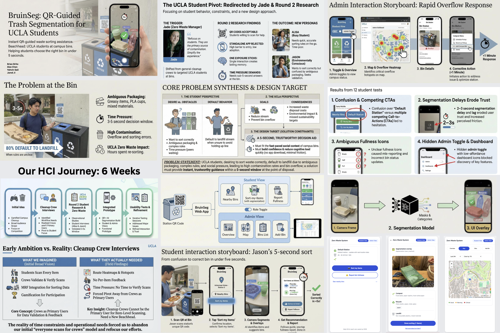

Please refer to the README files in ML-seg and website for the setup. Code: https://github.com/xingzhao-ji/trash-seg/tree/main

# Zero Waste Bin Monitoring System

A full-stack web application for trash sorting and bin monitoring, optimized for mobile devices and integrated with UCLA Facilities Management.

## Tech Stack

- **Frontend**: React 18, Vite, CSS Modules
- **Backend**: Node.js, Express.js
- **Database**: MongoDB with Mongoose ODM
- **AI Integration**: See ML-seg
- **Development Tools**: GitHub, Claude/Gemini/ChatGPT for AI assistance

We defer further details to the README files in ML-seg and the website. 

